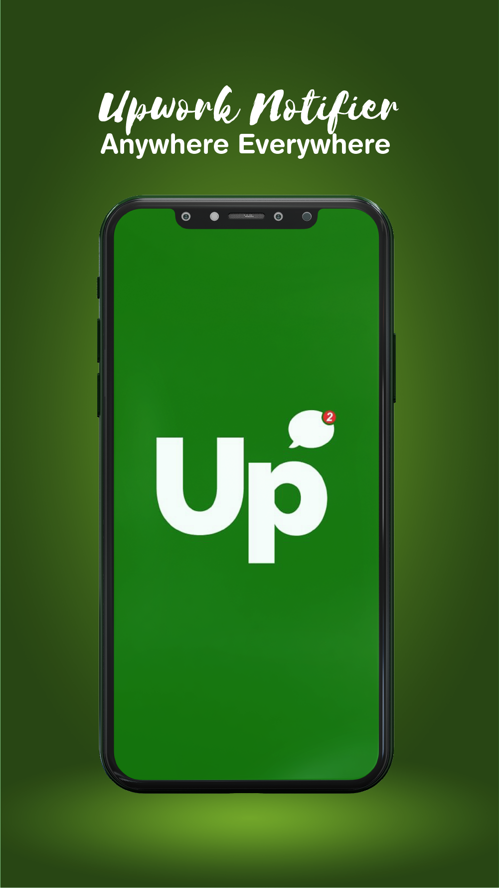

# Flutter Upwork Notifier

Do you miss important notifications every day as a freelancer? Are you a freelancer or remote worker who often finds it difficult to respond quickly to clients? Are you always missing bidding on related projects uploaded on Upwork, the popular freelance platform? No worries! You are at the right place.

"Upwork Notifier" is a productivity tool designed specifically for freelancers who work on Upwork. It provides quick notifications and job alerts to freelancers on their mobile devices when someone uploads a related project for bidding on the platform. With this app, you can upload your proposals within a few seconds and never miss a good project related to your skills.

This app also includes a user-friendly proposal editor, where you can easily write, copy, save, or edit proposals within a minute. You can add projects through URLs or categories, and create and edit your account details easily. "Upwork Notifier" allows you to exclude any country from which you don't want to receive work. You can enable or disable the "do not disturb" option anytime.
⭐️ the repo if you love it.

## Features of "Upwork Notifier" include:💡

- Easy to use
- Quick notifications and job alerts
- Never miss a related project
- Apply for Remote jobs before everyone else
- Fast to respond
- Best upwork bidding app
- Add projects through URL or category
- Save and edit proposals
- User-friendly interface
- 100% satisfaction
- Fully safe and secure

## Preview 📸

    

